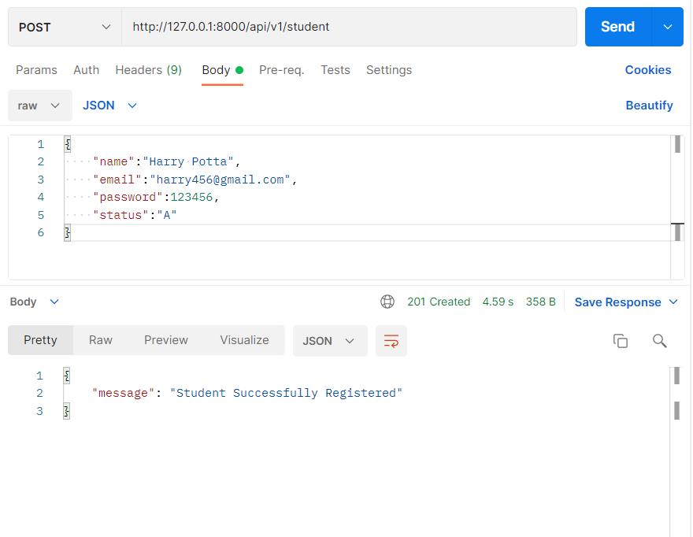
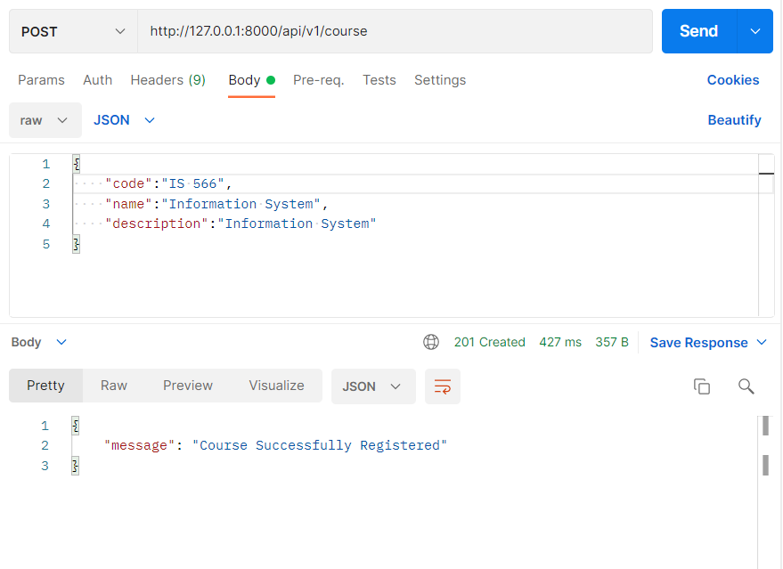
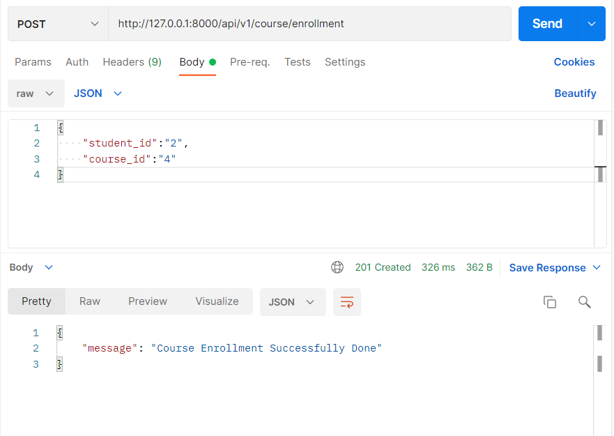
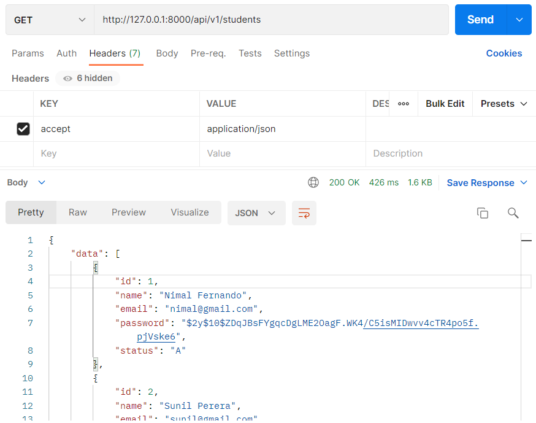
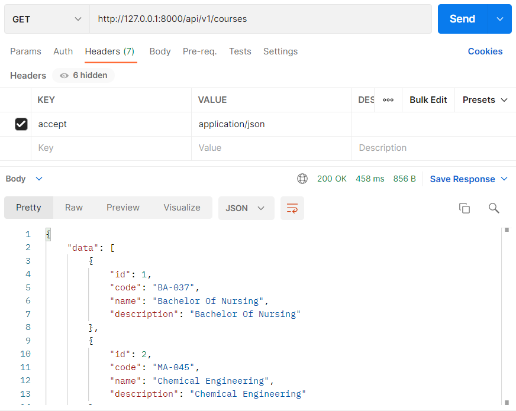
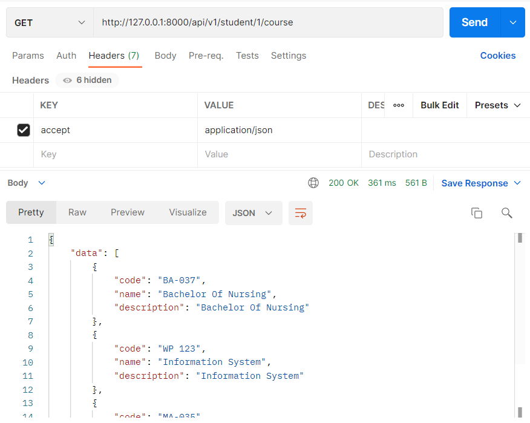
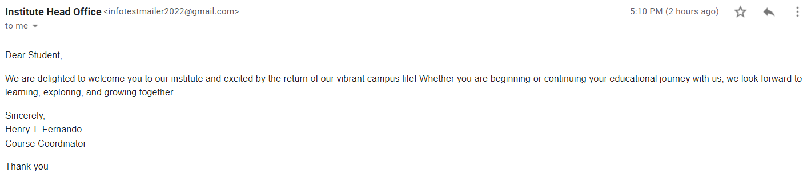

<p align="center"><a href="https://laravel.com" target="_blank"></a></p>

<p align="center">
<a href="https://travis-ci.org/laravel/framework"></a>
<a href="https://packagist.org/packages/laravel/framework"></a>
<a href="https://packagist.org/packages/laravel/framework"></a>
<a href="https://packagist.org/packages/laravel/framework"></a>
</p>

## Institute Management

#### Laravel Setup (Laravel version 8 - PHP 7.4)

- install apache server PHP 7.4
- install composer
- clone laravel `Institute Management Project` to the apache sever environment (PHP 7.4)
- run `composer install`


#### Database setup (MySql) & mail server

Create DB Name 'support_platform_db'
Query: `CREATE DATABASE institute_db;`

create `.env` file using `.env.example` in laravel, update DB connection infomation

````
DB_HOST=localhost
DB_PORT=3306
DB_DATABASE=institute_db
DB_USERNAME=root
DB_PASSWORD=root
````
````
MAIL_DRIVER=smtp
MAIL_HOST=smtp.gmail.com
MAIL_PORT=587
MAIL_USERNAME=infotestmailer2022@gmail.com
MAIL_PASSWORD=testmailer@123
MAIL_ENCRYPTION=tls
MAIL_FROM_ADDRESS=infotestmailer2022@gmail.com
MAIL_FROM_NAME="Institute Head Office"
````

- migrate table to DB
  COMMAND: `php artisan migrate:fresh`

#### Run Laravel Application

COMMAND: `php artisan serve`
Server (http://127.0.0.1:8000) started message come

Base Path: http://127.0.0.1:8000/<route>

#### Postman Collection

````
https://www.getpostman.com/collections/796df113e3ad9cbc1f39
````

#### Screenshots

1. Register Student



2. Register Course



3. Course Enrollment to Student



4. Get Students Info



5. Get Courses Info



6. Get Courses Enrollment to Student



7. Student Welcome Email Message


